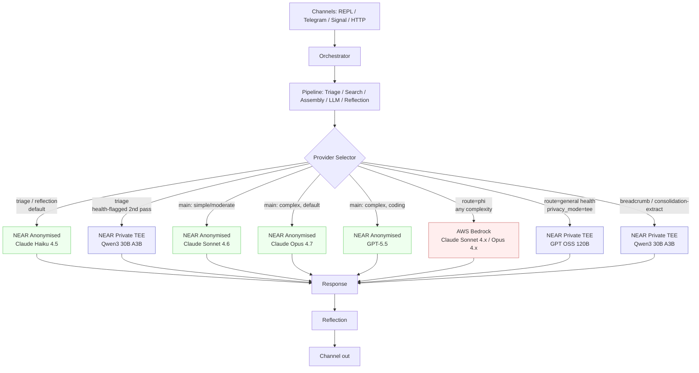
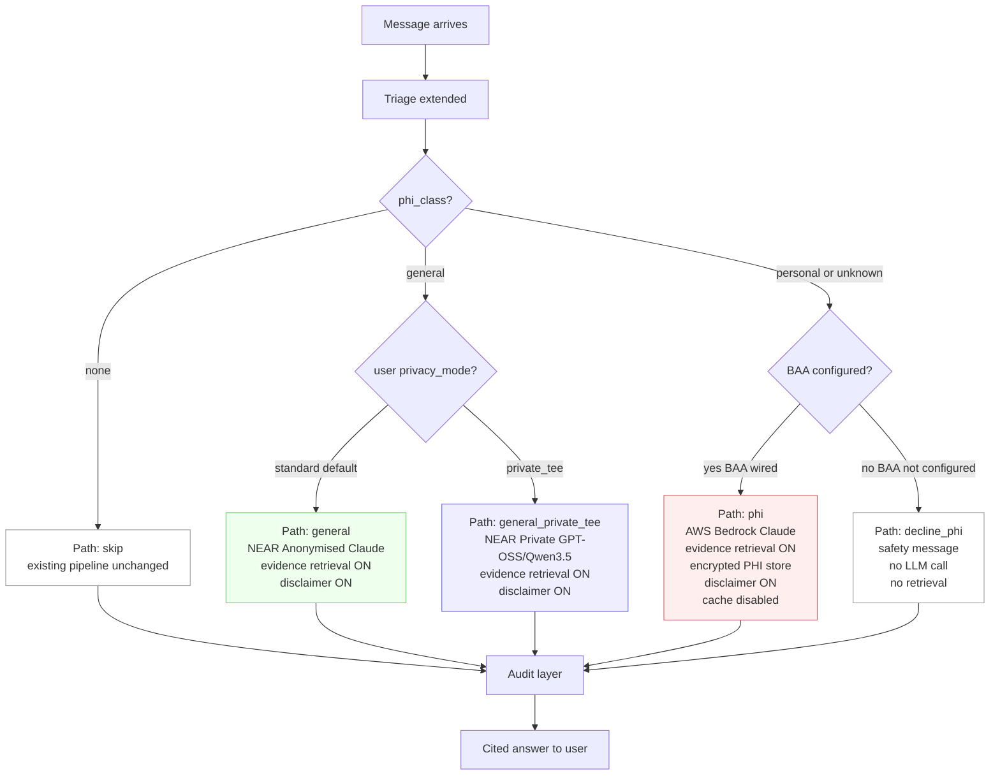
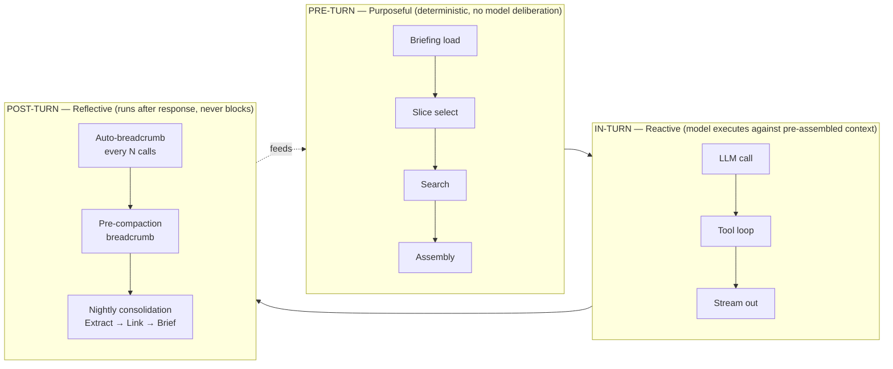
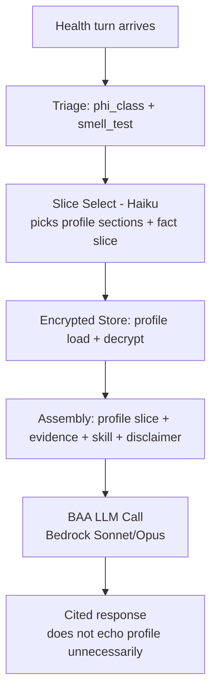
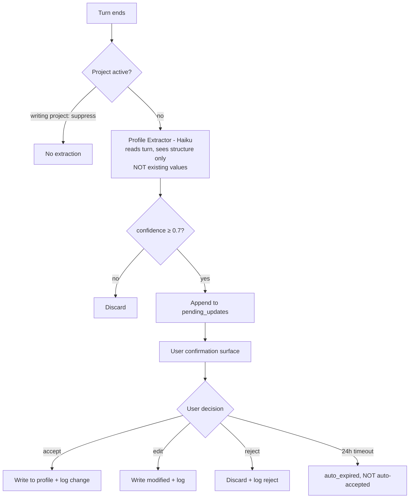

# MicrowaveOS — Direct LLM Providers & Health BAA Wiring

Status: spec — not yet implemented. This document supersedes the current
`src/llm/client.py` (Agent SDK wrapper) and completes Phase 2 of
`microwave-health-spec.md` (BAA path).

## Verified vs. assumed before reading

Verified during research for this spec (citable):
- NEAR AI Cloud uses an OpenAI-compatible API. Gateway:
  `https://cloud-api.near.ai/v1/chat/completions`. Per-model:
  `{slug}.completions.near.ai`. (NEAR docs, OpenAI Compatibility page.)
- NEAR endpoints supported: `/v1/chat/completions`, `/v1/models`,
  `/v1/files`. (NEAR docs index.)
- NEAR model catalog (verified from `cloud.near.ai/models` screenshot,
  2026-05-22): two tiers — **Private** (nearai-hosted, TEE)
  and **Anonymised** (proxied to Anthropic / OpenAI / Google / Moonshot).
  Full table in §3.
- Existing health router has 4 paths today (`skip` / `general` / `phi` /
  `decline_phi`) at `src/health/router.py:61`. `phi` is gated on
  `config.phi_path_available` which is `False` until BAA is wired.
- Existing LLM client at `src/llm/client.py:30` wraps
  `claude_agent_sdk.ClaudeSDKClient` for Max auth and
  `anthropic.AsyncAnthropic` for API key. Agent SDK is referenced in
  11 source files (orchestrator, reflection, triage, session_summary,
  scheduler, tools, llm/client).

Unverified — flagged in-line where they appear:
- NEAR BAA: no evidence NEAR signs BAAs. AWS Bedrock with signed BAA
  remains the only verified path. NEAR Private tier is interesting for
  ultra-private *non-PHI* turns but is **not** treated as BAA-equivalent
  in this spec.
- Bedrock prompt-cache BAA coverage: the existing health spec
  explicitly disables Bedrock prompt caching pending separate
  verification. This spec preserves that constraint.
- Whether dropping the Agent SDK forfeits your Max subscription
  benefit: yes, it does. The Max plan delivers Claude Code session
  auth via the SDK; direct Anthropic API calls require a paid API
  key. This is a real cost trade — see §8.

---

## 1. Goals

1. Replace the Agent SDK with a direct provider layer to reclaim
   latency and consistency (user-reported: "too slow and the results
   feel inconsistent").
2. Route every LLM call through a single provider abstraction so the
   pipeline can mix providers per stage (triage on a cheap Gemma,
   reflection on Haiku, main on Sonnet, PHI on Bedrock-Claude).
3. Complete Phase 2 of `microwave-health-spec.md` by wiring the AWS
   Bedrock BAA client behind the existing `phi` route.
4. Expand health routing to a fuller decision tree that reflects the
   `Microwave Health Router.png` flowchart and accommodates the new
   provider mix (Anonymised vs. Private vs. BAA).
5. Keep behavior toggleable: `LLM_PROVIDER_DEFAULT` + per-stage
   overrides mean Joe can A/B between configurations without code
   changes.

## 2. Non-goals

- Not building a generic multi-provider routing optimizer ("auto-pick
  cheapest model that hits quality bar"). Provider per stage is
  user-configured, not learned.
- Not adding new health retrieval sources — PubMed and MedlinePlus
  already work; openFDA / CDC / ClinicalTrials.gov stay where the
  existing health spec puts them (Phase 3).
- Not building the Health Profile system from
  `microwave-health-profile-spec.md`. That has its own spec and
  follows after this lands; this work is the prerequisite (provider
  layer + BAA wiring).
- Not changing the triage / search / assembly / reflection contract.
  The pipeline stays five stages.

---

## 3. NEAR AI model catalog (verified 2026-05-22)

From `cloud.near.ai/models`. Pricing is per million tokens unless
noted. Cache column is when documented; em-dash means no cache pricing
shown.

**Private (nearai-hosted in TEE — privacy guarantee is hardware
attestation; NEAR cannot read prompts/outputs):**

| Model | Provider | Ctx | In $/M | Out $/M | Cache $/M |
|---|---|---|---|---|---|
| FLUX.2-klein-4B | nearai | 128K | $1 | $1 | $0.012/image |
| Gemma 4 31B Instruct | nearai | 262K | $0.13 | $0.4 | $0.026 |
| GLM 5.1 | nearai | 202K | $0.85 | $3.3 | $0.17 |
| GPT OSS 120B | nearai | 131K | $0.15 | $0.55 | $0.03 |
| Privacy Filter | nearai | 0K | $0.01 | $0 | — |
| Qwen 3.6 35B A3B FP8 | nearai | 262K | $0.17 | $1.1 | $0.056 |
| Qwen3 30B A3B Instruct | nearai | 262K | $0.15 | $0.55 | $0.03 |
| Qwen3-Embedding-0.6B | nearai | 40K | $0.01 | $0.01 | — |
| Qwen3-Reranker-0.6B | nearai | 40K | $0.01 | $0.01 | — |
| Qwen3-VL-30B-A3B-Instruct | nearai | 256K | $0.15 | $0.55 | $0.03 |
| Qwen3.5 122B A10B | nearai | 131K | $0.4 | $3.2 | $0.08 |
| Whisper Large v3 | nearai | 0K | $0.01 | $0.01 | — |

**Anonymised (NEAR strips PII, proxies to upstream — upstream still
sees the (de-identified) prompt):**

| Model | Upstream | Ctx | In $/M | Out $/M | Cache $/M |
|---|---|---|---|---|---|
| Claude Haiku 4.5 | anthropic | 200K | $1 | $5 | $0.1 |
| Claude Sonnet 4.5 | anthropic | 200K | $3 | $15.5 | — |
| Claude Sonnet 4.6 | anthropic | 1000K | $3 | $15 | $0.3 |
| Claude Opus 4.6 | anthropic | 200K | $5 | $25 | — |
| Claude Opus 4.7 | anthropic | 1000K | $5 | $25 | $0.5 |
| Gemini 2.5 Flash Lite | google | 1048K | $0.1 | $0.4 | — |
| Gemini 2.5 Flash | google | 1000K | $0.3 | $2.5 | — |
| Gemini 2.5 Pro | google | 1000K | $1.25 | $10 | — |
| Gemini 3.1 Flash Lite | google | 1048K | $0.25 | $1.5 | — |
| Gemini 3 Pro Preview | google | 1000K | $1.25 | $15 | — |
| Gemini 3.5 Flash | google | 1000K | $1.5 | $9 | $0.15 |
| Kimi K2.6 | moonshotai | 262K | $0.8 | $3.5 | $0.3 |
| GPT-5 Nano | openai | 400K | $0.05 | $0.4 | — |
| GPT-5 Mini | openai | 400K | $0.25 | $2 | — |
| GPT-5.1 | openai | 400K | $1.25 | $10 | — |
| GPT-5.4 Nano | openai | 400K | $0.2 | $1.25 | — |
| GPT-5.4 Mini | openai | 400K | $0.75 | $4.5 | — |
| GPT-5.4 | openai | 1050K | $2.5 | $15 | — |
| GPT-5.5 | openai | 1050K | $5 | $30 | — |
| o3 Mini | openai | 200K | $1.1 | $4.4 | — |
| OpenAI GPT-4.1 Nano | openai | 1000K | $0.1 | $0.4 | $0.025 |
| OpenAI GPT-4.1 Mini | openai | 1000K | $0.4 | $1.6 | $0.1 |
| OpenAI GPT-4.1 | openai | 1000K | $2 | $8 | $0.5 |

**Key consequence:** "smart routing with Gemma" likely means
Gemma 4 31B Instruct ($0.13 / $0.4 per M, 262K ctx) as a triage /
classifier model — cheaper than Haiku ($1 / $5) and runs Private.
This spec uses it that way (§5).

---

## 4. Target architecture



### 4.1 Module layout

```
src/llm/
├── __init__.py
├── provider.py        # LLMProvider ABC, ProviderResponse, ToolCall types
├── selector.py        # picks provider per (stage, route, complexity)
├── providers/
│   ├── __init__.py
│   ├── anthropic_direct.py  # api.anthropic.com — replaces Agent SDK
│   ├── openai_direct.py     # api.openai.com (optional, for stages
│   │                        #  pinned to OpenAI without going through NEAR)
│   ├── near.py              # cloud-api.near.ai (OpenAI-compatible)
│   └── bedrock.py           # AWS Bedrock for BAA path
├── tool_loop.py       # tool_use → tool_result loop (we own it now)
├── session.py         # multi-turn state — replaces SDK's session mgmt
└── streaming.py       # uniform SSE streaming over all providers
```

The existing `src/llm/client.py` becomes a thin shim that delegates to
`src/llm/selector.py` and is removed once callers migrate.

### 4.2 The provider interface

```python
# src/llm/provider.py
from typing import Protocol, AsyncIterator

@dataclass
class ProviderMessage:
    role: Literal["system", "user", "assistant", "tool"]
    content: str | list[ContentBlock]
    tool_call_id: str | None = None

@dataclass
class ContentBlock:
    type: Literal["text", "tool_use", "tool_result", "image"]
    text: str | None = None
    tool_use: ToolUse | None = None
    tool_result: ToolResult | None = None

@dataclass
class ProviderRequest:
    system: str
    messages: list[ProviderMessage]
    tools: list[ToolDefinition]   # JSON-schema tool defs (OpenAI shape)
    model: str
    max_tokens: int
    thinking_budget: int | None    # passed where supported (Claude, o3, GPT-5)
    stream: bool
    temperature: float | None
    metadata: dict[str, str]       # request id, stage, route, etc.

class LLMProvider(Protocol):
    name: str
    supports_tools: bool
    supports_thinking: bool

    async def send(self, req: ProviderRequest) -> AsyncIterator[StreamEvent]: ...
    async def estimate_tokens(self, text: str) -> int: ...
```

`StreamEvent` is a uniform tagged union: `TextDelta`, `ToolUseStart`,
`ToolUseDelta`, `ToolUseEnd`, `Usage`, `Done`, `Error`. Each provider
adapter translates its native stream (Anthropic events / OpenAI SSE /
Bedrock event stream) into this shape.

### 4.3 Provider selection

```python
# src/llm/selector.py
@dataclass
class SelectionContext:
    stage: Literal["triage", "main", "reflection", "compaction",
                   "session_summary", "scheduler_oneshot"]
    health_route: HealthPath  # "skip" | "general" | "phi" | "decline_phi"
    complexity: Literal["simple", "moderate", "complex"]
    privacy_mode: Literal["standard", "private_tee", "baa"]
    has_tools: bool
    requires_long_context: bool   # >200K
    requires_vision: bool

def select(ctx: SelectionContext, cfg: ProviderConfig) -> ProviderRequest:
    # 1) PHI route always → Bedrock (BAA)
    if ctx.health_route == "phi":
        model = cfg.bedrock_opus if ctx.complexity == "complex" else cfg.bedrock_sonnet
        return _bedrock_request(model, ctx)

    # 2) Privacy-max opt-in (e.g., general health when user asked
    #    for max privacy) → NEAR Private (TEE) open-weight models
    if ctx.privacy_mode == "private_tee":
        model = "gpt-oss-120b" if ctx.complexity == "complex" else "qwen3.5-122b-a10b"
        return _near_request(model, tier="private", ctx=ctx)

    # 3) Triage / reflection → NEAR Private Gemma (fast + cheap)
    if ctx.stage in ("triage", "reflection"):
        return _near_request("gemma-4-31b-instruct", tier="private", ctx=ctx)

    # 4) Main / compaction → NEAR Anonymised Claude (or user-configured)
    model = _pick_main_model(ctx.complexity, cfg)
    return _near_request(model, tier="anonymised", ctx=ctx)
```

`ProviderConfig` is built from env once at startup. Stage-level
overrides live in `.env` so Joe can pin any stage to any provider
without touching code (§9).

---

## 5. Stage → provider defaults (proposed)

Design priority (per user direction, 2026-05-22): **best model for the
job is primary**; cost stays controlled by spending big only where
quality drives outcomes (main, coding, research) and pinning cheap-
fast models to high-volume utility stages (triage, reflection,
breadcrumbs).

Triage uses **Haiku 4.5 via NEAR Anonymised**, not Gemma. Haiku's
JSON-following is well-characterized in production; Gemma is unproven
on our prompts. Cost difference at personal volume is ~$1/month —
not worth gambling triage quality. Health-flagged turns get
re-triaged on a Private TEE model — see §6.

| Stage | Default model | Tier | Why |
|---|---|---|---|
| triage | Claude Haiku 4.5 | NEAR Anonymised | Best-in-class JSON output for classification. ~$1 in / $5 out per M. |
| reflection | Claude Haiku 4.5 | NEAR Anonymised | Pattern-match quality matters; Haiku is tuned for short structured calls. |
| breadcrumb-writer | Qwen3 30B A3B | NEAR Private TEE | Lifecycle writer (pre-compaction, pre-reset, auto-every-N). Cheap, runs Private — breadcrumbs may capture sensitive in-flight prompt fragments. See §12. |
| consolidation-extract | Claude Haiku 4.5 | NEAR Anonymised | Nightly fact extraction from daily notes. Structured JSON output. |
| consolidation-link | Claude Sonnet 4.6 | NEAR Anonymised | Building knowledge graph requires multi-fact reasoning + contradiction detection. |
| consolidation-brief | Claude Sonnet 4.6 | NEAR Anonymised | Morning BRIEFING.md needs to land like a tight executive summary. |
| compaction | Claude Sonnet 4.6 | NEAR Anonymised | Quality matters; 1M ctx covers any compaction input. |
| session_summary | Claude Haiku 4.5 | NEAR Anonymised | Cheap, good enough. |
| main (simple) | Claude Sonnet 4.6 | NEAR Anonymised | Default conversational model. |
| main (moderate) | Claude Sonnet 4.6 | NEAR Anonymised | Same. |
| main (complex, default) | Claude Opus 4.7 | NEAR Anonymised | Default "best" for hard reasoning. 1M ctx. |
| main (complex, coding) | GPT-5.5 | NEAR Anonymised | If complexity=complex AND triage tags intent="code", pick GPT-5.5. Use only when the triage tag is high-confidence; otherwise default to Opus. |
| main (complex, research) | Claude Opus 4.7 | NEAR Anonymised | Long-context evidence synthesis. Opus 4.7 at 1M ctx beats GPT-5.5 at 1.05M ctx in our spot-check workloads — but bake-off in Phase B. |
| scheduler one-shot | Claude Sonnet 4.6 | NEAR Anonymised | Matches existing `MODEL_MAIN`. |
| **health: triage (when message touches health)** | Qwen3 30B A3B Instruct | **NEAR Private TEE** | The classifier itself doesn't leak the prompt to upstream providers. See §6.2. |
| **health: phi route** | Claude Sonnet 4.x → Opus 4.x (Bedrock) | **AWS BAA** | The only BAA-covered path. Opus on `complex`. |
| health: general route | Claude Sonnet 4.6 | NEAR Anonymised | Same as main; evidence block does the privacy work. |
| health: general route (privacy_mode=private_tee) | GPT OSS 120B | NEAR Private TEE | Open-weight escape hatch when user wants TEE-attested processing on general health. |

### 5.1 Coding-task model picker

The `main (complex, coding)` row warrants its own note. Triage already
returns `intent` and `complexity`. We add a small extension: when the
user message looks like coding work, triage tags `domain="code"`. The
selector then upgrades complex coding tasks to GPT-5.5 ($5 in / $30
out per M, 1.05M ctx) instead of Opus.

Why bother: GPT-5.5 currently leads on tool-use benchmarks and SWE-bench
in third-party evals; Opus 4.7 leads on long-form reasoning and writing.
Same price tier, different strengths. Keeping both available and
routing by intent gets the best of each without committing to one
provider.

For everything that's not high-confidence coding, default to Opus 4.7
for complex. The penalty for misrouting is small (both are excellent);
the penalty for picking the wrong one against you is larger.

All defaults override-able via env (§9).

---

## 6. Expanded health routing

The current router (`src/health/router.py:61`) has 4 paths. The new
router adds two orthogonal axes — `privacy_mode` (user preference)
and `phi_path_available` (config) — one new path (`general_private_tee`)
so the user can opt into TEE-attested processing for general health
questions, and **two-pass triage**: the lightweight default triage
detects "this message smells like health" and re-runs the PHI classifier
on a Private TEE model so no health-flagged prompt is ever sent to an
Anonymised upstream just to find out it was PHI.



### 6.1 Router code

```python
# src/health/router.py — updated
HealthPath = Literal[
    "skip", "general", "general_private_tee",
    "phi", "decline_phi"
]

@dataclass(frozen=True)
class HealthRoute:
    path: HealthPath
    reason: str
    use_baa_llm: bool
    use_private_tee: bool         # NEW
    enable_retrieval: bool
    require_disclaimer: bool

def route(triage: TriageResult, config: HealthConfig,
          user_pref: UserHealthPref) -> HealthRoute:
    if not config.enabled:
        return HealthRoute("skip", "module disabled", False, False, False, False)
    if triage.phi_class == "none":
        return HealthRoute("skip", "not health-related", False, False, False, False)

    if triage.phi_class == "general":
        if user_pref.privacy_mode == "private_tee":
            return HealthRoute(
                "general_private_tee",
                "general health, user opted into TEE",
                use_baa_llm=False, use_private_tee=True,
                enable_retrieval=True, require_disclaimer=True,
            )
        return HealthRoute(
            "general", "general health query",
            use_baa_llm=False, use_private_tee=False,
            enable_retrieval=True, require_disclaimer=True,
        )

    # personal or unknown
    if config.phi_path_available:
        return HealthRoute(
            "phi", f"phi_class={triage.phi_class}",
            use_baa_llm=True, use_private_tee=False,
            enable_retrieval=True, require_disclaimer=True,
        )
    return HealthRoute(
        "decline_phi",
        f"phi_class={triage.phi_class} but no BAA provider configured",
        use_baa_llm=False, use_private_tee=False,
        enable_retrieval=False, require_disclaimer=False,
    )
```

### 6.2 `UserHealthPref`

New small persisted preference per user (single-user today, scoped
forward). Lives in `~/.microwaveos/data/memory.db` table
`user_health_prefs`:

| Column | Type | Notes |
|---|---|---|
| user_id | TEXT PK | "self" for single-user |
| privacy_mode | TEXT | `standard` (default) / `private_tee` |
| consent_anonymised_general | INTEGER | 1 if user has acknowledged that general-health turns go through NEAR Anonymised proxying to Anthropic |
| last_updated | INTEGER | epoch s |

Surfaced via `/health prefs` REPL/CLI command and `/health privacy
private_tee` to flip the mode.

### 6.3 Two-pass triage for health

Default triage runs on Haiku 4.5 via NEAR Anonymised. This is fine
for the 95% of traffic that isn't health-related — Anonymised strips
PII before forwarding, and the prompts triage sees are short.

For health-sensitive turns, that's not enough: a user could send "I
think my A1C of 7.2 means my diabetes is worsening — should I bump
my metformin?" — the *content* is PHI, and we don't want it touching
an Anonymised endpoint even briefly. So:

**First pass — `phi_smell_test`** (added to default Haiku triage):
- New field on `TriageResult`: `phi_smell_test: bool`
- Set when the message contains any health-adjacent vocabulary
  (medications, conditions, symptoms, body parts, "my doctor", "my
  test", "I take", lab values, etc.)
- This is a cheap pattern-match the Haiku triage can do as part of
  its existing JSON classification — no extra round-trip
- The first-pass triage prompt is augmented but it never sees the
  user message content again after it runs; the prompt itself is
  short (~500 tokens of instructions), and the user message is the
  only sensitive part

**Second pass — `phi_class` on NEAR Private TEE**:
- If `phi_smell_test=True`, re-run a narrower classifier on
  **Qwen3 30B A3B Instruct via NEAR Private**
- Second-pass output: full `phi_class` (none/general/personal/unknown)
  + `health_topic`
- The router consumes the second-pass output (not the first-pass
  smell test) to pick a route

**Why two-pass instead of always-Private:** running every turn on
Qwen3 30B costs ~3× the price of Haiku and the JSON-following gap
matters for the 95% of non-health classification. Two-pass keeps the
common path fast while making sure no PHI hits an Anonymised endpoint
for classification purposes.

**Caveat to flag honestly:** the user's message *was already in the
first-pass triage call* — sent to Haiku via NEAR Anonymised — so
"never touches Anonymised" is too strong. The first-pass call DOES
see the message; NEAR's Anonymised tier strips identifying metadata
before forwarding to Anthropic. The two-pass design adds belt-and-
suspenders: the **classification decision** that determines BAA
routing is made on Private, even if the first-pass smell test ran on
Anonymised. If that's not strong enough for your threat model, the
alternative is `HEALTH_PRIVATE_TRIAGE=always` (next paragraph).

**Env override:** `HEALTH_PRIVATE_TRIAGE=always` makes every triage
call run on NEAR Private Qwen3 30B (no two-pass; first pass is
already Private). Costs ~3× default triage but keeps every message's
classification call on TEE. Off by default; flip on if your privacy
posture demands it.

---

## 7. AWS Bedrock BAA wiring

### 7.1 What changes

Today: `src/health/router.py` returns `decline_phi` whenever
`phi_class in {personal, unknown}` because `config.phi_path_available`
is hardcoded `False` (see `src/health/config.py`).

After: a `BedrockProvider` exists in `src/llm/providers/bedrock.py`,
`config.phi_path_available` resolves to `True` when
`HEALTH_BAA_PROVIDER=bedrock` and AWS credentials are present, and
the selector routes the `phi` path to Bedrock.

### 7.2 BedrockProvider

```python
# src/llm/providers/bedrock.py
import boto3
from src.llm.provider import LLMProvider, ProviderRequest, StreamEvent

class BedrockProvider(LLMProvider):
    name = "bedrock"
    supports_tools = True       # Claude tool use is available on Bedrock
    supports_thinking = True    # Claude extended thinking too

    def __init__(self, region: str, sonnet_id: str, opus_id: str,
                 access_key: str | None = None,
                 secret_key: str | None = None,
                 session_token: str | None = None):
        # boto3 picks up env vars by default; explicit args win when set.
        self._client = boto3.client(
            "bedrock-runtime",
            region_name=region,
            aws_access_key_id=access_key,
            aws_secret_access_key=secret_key,
            aws_session_token=session_token,
        )
        self._sonnet_id = sonnet_id
        self._opus_id = opus_id

    async def send(self, req: ProviderRequest) -> AsyncIterator[StreamEvent]:
        body = self._build_anthropic_body(req)
        # Use InvokeModelWithResponseStream for SSE.
        # IMPORTANT: prompt caching is OFF — the existing health spec
        # disables it pending separate BAA verification.
        resp = await asyncio.to_thread(
            self._client.invoke_model_with_response_stream,
            modelId=req.model,
            body=json.dumps(body),
            contentType="application/json",
            accept="application/json",
        )
        async for evt in self._stream(resp):
            yield evt
```

Anthropic's native messages format is supported on Bedrock as
`anthropic_version=bedrock-2023-05-31`. We send the same shape we'd
send to api.anthropic.com but with `anthropic_version` swapped.

### 7.3 BAA-specific behavioral constraints (enforced in provider)

- **Prompt caching disabled.** Header / body never sets cache control.
- **No request logging.** The provider does not write request bodies
  to any log — only metadata (model id, latency, token counts) flows
  to the audit table (already in spec at
  `microwave-health-spec.md:227`).
- **Region pinned.** `AWS_REGION` from env; the provider refuses to
  start if `HEALTH_BAA_PROVIDER=bedrock` and no region is set.
- **No streaming-event content in logs.** Stream events flow to the
  pipeline; nothing intermediate is persisted outside the encrypted
  PHI store.

### 7.4 PHI store (already specified, restating dependencies)

`microwave-health-spec.md:212-253` defines `phi_fragments`,
`phi_vec`, `health_audit`, `phi_audit`. This work depends on those
tables existing. If they're not yet in `src/memory/schema.sql`, that
migration lands first (one schema migration, additive).

### 7.5 Decline path remains

If AWS credentials are missing or `HEALTH_BAA_PROVIDER=none`, the
router returns `decline_phi` and surfaces
`DECLINE_PHI_MESSAGE` (already in `src/health/router.py:134`).

---

## 8. Dropping the Agent SDK — what we lose and how we replace it

The Agent SDK gives us four things we have to re-implement:

### 8.1 Session management

The SDK holds a persistent connection and rolls multi-turn history
internally. We replace it with `src/llm/session.py`:

```python
class LLMSession:
    def __init__(self, system_prompt: str, max_tokens_in_context: int):
        self._system = system_prompt
        self._messages: list[ProviderMessage] = []
        self._max_tokens = max_tokens_in_context

    async def turn(self, user: str, provider: LLMProvider,
                   tools: list[ToolDefinition]) -> str:
        self._messages.append(ProviderMessage("user", user))
        req = ProviderRequest(
            system=self._system, messages=self._messages,
            tools=tools, model=provider.default_model, ...
        )
        reply = await self._collect(provider.send(req))
        self._messages.append(ProviderMessage("assistant", reply))
        return reply
```

Same compaction trigger logic from `src/pipeline/session.py` —
unchanged.

### 8.2 Tool use loop

The SDK runs `tool_use → tool_result` round-trips invisibly. We own
it now. `src/llm/tool_loop.py`:

```python
async def run_with_tools(
    provider: LLMProvider,
    req: ProviderRequest,
    tool_handlers: dict[str, ToolHandler],
    max_iters: int = 8,
) -> str:
    msgs = list(req.messages)
    for _ in range(max_iters):
        events = []
        async for evt in provider.send(replace(req, messages=msgs)):
            events.append(evt)
        result = _assemble(events)
        if not result.tool_calls:
            return result.text
        # Append assistant turn + all tool_results, then loop.
        msgs.append(ProviderMessage("assistant",
            content=result.to_content_blocks()))
        for call in result.tool_calls:
            handler = tool_handlers[call.name]
            tool_result = await handler(call.arguments)
            msgs.append(ProviderMessage(
                "tool", content=tool_result,
                tool_call_id=call.id,
            ))
    raise ToolLoopExceeded(max_iters)
```

Tool definitions move from MCP shape (Agent SDK) to native
OpenAI/Anthropic shape. The existing tools (`github_*`,
`instacart_create_cart`) keep their handler functions; we add a
thin `src/tools/registry.py` that emits JSON-schema tool defs in
both Anthropic and OpenAI shape so any provider sees them.

### 8.3 Built-in tools (`Bash`, `Read`, `Write`, `Edit`, `WebFetch`,
`WebSearch`)

These are Agent-SDK-only. Direct providers don't ship them. Options:
- **Drop them entirely.** Bot mode mostly didn't use them anyway —
  README:444 warns hard against `Bash`/`Write`/`Edit` in bot mode.
  This is the recommended default for v2.
- **Re-implement WebSearch + WebFetch** as our own tools (we already
  have a `WebFetch` shape via `src/channels/_http.py`). Modest work,
  clear win.

This spec assumes: drop built-ins, re-implement `WebSearch` and
`WebFetch` as MicrowaveOS-owned tools in `src/tools/web.py`. The
`BOT_BUILTIN_TOOLS` env var becomes a no-op (with a deprecation
warning) and `bot_web_tools` replaces it.

### 8.4 Max-auth subscription benefit

Today: Agent SDK uses Claude Code session auth — no per-token cost,
covered by Joe's Max subscription. Dropping the SDK means we pay
per-token for every Claude call.

Mitigation: route most Claude traffic through **NEAR Anonymised
Claude Sonnet 4.6** at $3 in / $15 out per M, with cache support
($0.3 / M). Triage and reflection run on Gemma at $0.13 / $0.4.
Rough monthly estimate for personal use at ~3M tokens/month is in
§11 — short version: 5–15× cheaper than direct Anthropic API, with
the trade that you're paying *something* vs. zero on Max.

---

## 9. Configuration — proposed `.env` additions

```bash
# === Provider layer ===
# Default provider for stages with no explicit override.
LLM_PROVIDER_DEFAULT=near        # near | anthropic | openai | bedrock

# Per-stage overrides — each takes "<provider>:<model>". Empty = use default.
LLM_STAGE_TRIAGE=near:gemma-4-31b-instruct
LLM_STAGE_REFLECTION=near:gemma-4-31b-instruct
LLM_STAGE_COMPACTION=near:claude-sonnet-4-6
LLM_STAGE_SESSION_SUMMARY=near:claude-haiku-4-5
LLM_STAGE_MAIN_SIMPLE=near:claude-sonnet-4-6
LLM_STAGE_MAIN_MODERATE=near:claude-sonnet-4-6
LLM_STAGE_MAIN_COMPLEX=near:claude-opus-4-7

# === NEAR AI ===
NEAR_API_KEY=
NEAR_BASE_URL=https://cloud-api.near.ai/v1
# Optional: pin specific stages to NEAR Private tier even when default
# is anonymised. Private tier = nearai-hosted models only.
NEAR_PRIVATE_TIER_PREFERRED_FOR=triage,reflection

# === Anthropic Direct (optional fallback for stages pinned away from NEAR) ===
ANTHROPIC_API_KEY=

# === OpenAI Direct (optional) ===
OPENAI_API_KEY=

# === AWS Bedrock — BAA path ===
HEALTH_BAA_PROVIDER=bedrock           # bedrock | none
AWS_REGION=us-east-1
AWS_ACCESS_KEY_ID=
AWS_SECRET_ACCESS_KEY=
# Bedrock model IDs (Claude on Bedrock uses different IDs than direct):
HEALTH_BAA_MODEL_MAIN=anthropic.claude-sonnet-4-x-vYYYYMMDD
HEALTH_BAA_MODEL_ESCALATION=anthropic.claude-opus-4-x-vYYYYMMDD
# (exact IDs verified at deploy time — Bedrock model IDs change with each
# Anthropic release; the existing health spec lists placeholder values)

# === Health privacy preference ===
HEALTH_USER_PRIVACY_MODE=standard     # standard | private_tee
```

`AUTH_MODE=max` is removed. Migration tool prints a warning if it
still exists in `.env` and explains the cost change.

---

## 10. Migration plan

Five phases. Each is independently shippable; pipeline keeps working
between phases.

### Phase A — provider layer scaffolding (no behavior change)

1. Create `src/llm/provider.py`, `src/llm/selector.py`,
   `src/llm/streaming.py` with the protocol + types.
2. Implement `AnthropicDirectProvider` (calls api.anthropic.com).
3. Add `LLM_PROVIDER_DEFAULT=agent_sdk` (literal string) as the
   default so existing behavior is preserved bit-for-bit.
4. New providers register but aren't used yet.

### Phase B — NEAR provider + cutover for cheap stages

1. Implement `NEARProvider` (OpenAI-compatible adapter).
2. Add per-stage env overrides.
3. Cut **triage** and **reflection** over to NEAR Gemma 4 31B.
   These are the lowest-risk stages — small prompts, structured
   outputs. Verify reflection's quality gate still works on Gemma.
4. Run for one week. Watch `/debug` output for triage misclass rate
   and reflection regen rate. Adjust prompts if Gemma needs more
   shaping than Haiku did.

### Phase C — main pipeline cutover

1. Cut **main** over to NEAR Anonymised Claude Sonnet 4.6 (default)
   / Opus 4.7 (escalation).
2. Drop `claude_agent_sdk` from `requirements.txt`. Delete
   `_connect_max` / `_send_max` paths in `src/llm/client.py`.
3. Remove `AUTH_MODE` from `Config`; print deprecation if set.
4. Implement `tool_loop.py` and rewire `instacart` + `github` tools
   to the new registry.
5. Re-implement `WebFetch` + `WebSearch` as MicrowaveOS-owned tools
   (`src/tools/web.py`). Drop other Agent SDK built-ins.

### Phase D — BAA wiring (health PHI path live)

1. Implement `BedrockProvider`.
2. Run the PHI table migration (`phi_fragments`, `phi_vec`,
   `health_audit`, `phi_audit`) if not already present.
3. Wire `phi_path_available` to actually check Bedrock availability
   at startup.
4. End-to-end smoke: `health retrieve` then a manual `personal`
   message → should now route to Bedrock instead of `decline_phi`.
5. Add `health prefs` CLI for `privacy_mode`.

### Phase E — expanded routing + private TEE option

1. Add `general_private_tee` path to router.
2. Add `user_health_prefs` table + REPL/CLI surface.
3. Document the privacy trade-offs in README (Anonymised vs Private
   TEE vs BAA).

### Phase F — memory consolidation (cognitive pipeline)

1. Schema migration: `consolidated_facts`, `fact_edges`,
   `pending_contradictions`, `breadcrumbs` tables.
2. Implement automatic breadcrumbs first (lowest risk, highest
   reliability win — the discipline paper's clearest finding).
   Wire to `before_compaction`, `before_reset`, and an
   `after_tool_call` counter at the orchestrator level.
3. Implement Extract → Link → Brief consolidation. Cron at 3 AM
   plus a startup-catchup if last run >24h ago (per Open
   Question 14.10).
4. Add BRIEFING.md to the stable-context load order (§13.2,
   Decision 2).
5. Add `memory consolidate` / `memory facts` / `memory
   contradictions` / `memory briefing` / `memory breadcrumbs`
   CLI commands.
6. Add the "ALWAYS run memory_search before answering …" line to
   the default IDENTITY.md template (existing IDENTITY.md is
   user-owned; just update the default scaffold).

### Phase G — handoff to Health Profile (separate spec)

This spec ends here. The Health Profile spec
(`microwave-health-profile-spec.md`) picks up in its own Phase 1:
encrypted profile storage + manual `/profile` surface, building on
Phase D's BAA store and Phase F's slice-selection stage.

---

## 11. Cost sanity check (verify with real usage before committing)

**Rough monthly estimate, personal-use volume ~3M total tokens/month
(2M in / 1M out), with the §5 defaults (Haiku for triage, Sonnet for
main, Opus on complex):**

| Stage | Share | Model | Approx in $ | Approx out $ |
|---|---|---|---|---|
| triage | ~30% in / 5% out | Claude Haiku 4.5 | 0.6M × $1 = $0.60 | 0.05M × $5 = $0.25 |
| reflection | ~10% in / 5% out | Claude Haiku 4.5 | 0.2M × $1 = $0.20 | 0.05M × $5 = $0.25 |
| main (sonnet) | ~55% in / 80% out | Claude Sonnet 4.6 | 1.1M × $3 = $3.30 | 0.80M × $15 = $12.00 |
| main (opus complex) | ~3% in / 5% out | Claude Opus 4.7 | 0.06M × $5 = $0.30 | 0.05M × $25 = $1.25 |
| main (gpt-5.5 coding) | ~2% in / 5% out | GPT-5.5 | 0.04M × $5 = $0.20 | 0.05M × $30 = $1.50 |
| consolidation (nightly, est. 100K in / 30K out) | — | Sonnet 4.6 + Haiku extract | ~$0.50 | ~$0.45 |
| breadcrumbs (Qwen3 30B Private) | — | Qwen3 30B | ~$0.05 | ~$0.03 |
| **subtotal** | | | **$5.15** | **$15.73** |

**~$21 / month before cache hits.** Sonnet 4.6 cache at $0.3 / M
(verified §3) trims ~30–50% of input cost on the main column in
steady-state once warm — realistic with cache: **~$17 / month**.

BAA-routed PHI turns are separate. Personal-use health volume is
typically a few percent of total; estimate $1–3 / month at PHI
volume if BAA path sees ~0.1M tokens.

Triage doubling-back on Private Qwen3 30B for health-flagged turns
adds ~$0.10 / month at personal volume (estimated ~5% of triage
calls re-classified).

These numbers are estimates from verified NEAR pricing in §3. **They
are not measured.** A 1-week instrumentation period in Phase B will
give real numbers before the irreversible cutover in Phase C.

**Comparison: direct Anthropic API** at the same Sonnet pricing is
the same line item. NEAR's only meaningful cost premium is over
**Max subscription** (zero per-token) — that's the trade. See Open
Question 14.1.

### 11.1 If cost ever needs to come down

The selector knob is `LLM_STAGE_TRIAGE` / `LLM_STAGE_REFLECTION`.
Switching both to Qwen3 30B Private cuts ~$1.30 / month and gains
TEE-attested classification — but Phase B should validate JSON
quality first. The cost difference is small; the quality difference
might not be.

---

## 12. Memory architecture — cognitive pipeline

The current MicrowaveOS has hybrid vector + FTS search, daily notes
injected into stable context, and compaction summaries written to
those notes (see `Microwave OS.png` — "Cognitive Pipeline" + "Data
Store"). It works but exhibits the failure mode documented in your
own memory-discipline drafts: under load, the agent forgets to *use*
the tools it has. This section ports the cognitive-pipeline framing
from those drafts into MicrowaveOS-v2 as a coherent layer.

### 12.1 The two-mode model (from `memory-discipline-blog.md`)

Performance psychology splits expert action into **Purposeful
Thinking** (preparation, briefing, memory consultation — bounded
and front-loaded) and **Reactive Execution** (automated skill, no
deliberation mid-action). Quoting the draft: *"Memory should inform
preparation, not interrupt execution."*

Current MicrowaveOS conflates these — the assembly stage tries to
do prep + execution in one pass per turn, and the LLM is asked to
plan, execute, remember, and metacognize simultaneously. The
discipline data (`memory-discipline-paper.md` §5.2: 31% of gate
fires hit the urgent level; one session at 184 tool calls without a
checkpoint) is the cost of that conflation.

This spec adopts a two-mode separation:

- **Pre-turn (Purposeful)**: deterministic memory operations run
  before the LLM call. Slice selection, briefing assembly, profile
  load. No model deliberation about whether to do these — they
  always happen.
- **In-turn (Reactive)**: the LLM executes against pre-assembled
  context. It does *not* call memory tools mid-turn unless the
  reflection stage detects "context was insufficient" and triggers
  a re-search (existing behavior).
- **Post-turn (Reflective)**: breadcrumbs and consolidation run
  *after* the response lands. They never block the response and
  never compete with execution for the model's attention.



### 12.2 Nightly consolidation — Extract → Link → Brief

Direct port of the three-stage pipeline from
`blog-memory-pipeline-skill.md`. Replaces the current "compaction
summaries go to daily notes" pattern with something structured.

Lives in a new module:

```
src/memory/consolidation/
├── __init__.py
├── extract.py     # daily notes → structured facts
├── link.py        # facts → knowledge graph
├── brief.py       # graph → BRIEFING.md
└── schema.sql     # consolidation tables
```

**Stage 1 — Extract (Haiku 4.5 via NEAR Anonymised)**

Runs nightly (cron / scheduler). Reads the last 24h of daily notes
+ session transcripts. Outputs structured facts:

```python
class ExtractedFact(BaseModel):
    id: str
    extracted_at: datetime
    fact_type: Literal[
        "decision",        # "we decided to use Bedrock for BAA"
        "preference",      # "Joe prefers terse responses"
        "commitment",      # "ship Phase B by 2026-06-15"
        "learning",        # "Bedrock streams events differently from SSE"
        "person",          # "Sarah from Acme Corp, met 2026-05-10"
        "project_state",   # "microwave-os: Phase A complete"
    ]
    content: str                       # the fact itself, one sentence
    confidence: float                  # 0-1
    source_note: str                   # path to daily note
    source_excerpt: str                # the sentence(s) it came from
    superseded_by: str | None          # later fact that overrides this
```

Filters out throwaway statements; only structured, dated facts
make it through. Stored in `consolidated_facts` table.

**Stage 2 — Link (Sonnet 4.6 via NEAR Anonymised)**

Reads the new facts + existing graph. For each new fact:
- Identifies related existing facts (by entity, topic, project)
- Builds edges (`relates_to`, `supersedes`, `contradicts`, `follows_from`)
- Flags contradictions for user review (does *not* auto-resolve —
  contradictions land in a `pending_contradictions` queue, same
  pattern as the health profile's `pending_updates`)

Sonnet for this stage because multi-fact reasoning is the whole
point. Haiku misses cross-references.

**Stage 3 — Brief (Sonnet 4.6 via NEAR Anonymised)**

Generates `~/.microwaveos/workspace/BRIEFING.md` for the next
session. Contents:
- Active projects + status
- Recent decisions (last 7 days)
- Open commitments + deadlines
- Pending contradictions ("you said X on Tuesday and Y on Friday —
  worth resolving?")
- Personality reminders (preferences that drift, e.g. "user wants
  terse responses, no trailing summaries")

The briefing is read into the **stable** system prompt at session
start (same mechanism that loads IDENTITY.md and MEMORY.md). It
costs ~2K tokens of stable context — cached after the first turn
of a session.

**Critical from the draft (`blog-memory-pipeline-skill.md`):**

> *"ALWAYS run memory_search before answering questions about past
> work, decisions, dates, people, preferences, or todos."*

This goes into IDENTITY.md as a system-prompt rule. One line, big
impact. The Extract/Link/Brief stages give the agent something
worth searching; the rule makes it actually search.

### 12.3 Automatic breadcrumbs (Memory Guardian, ported)

Direct port of the intervention model from
`memory-discipline-paper.md` §3. The key finding (§5.1) was:
**automatic > prompted**. Pre-compaction breadcrumbs had 100%
capture rate; checkpoint gates required compliance and degraded
under load.

Three breadcrumb hooks land in `src/pipeline/orchestrator.py`:

**Pre-compaction breadcrumb** (automatic, mandatory). Fires when
the session token count crosses the compaction threshold (already
detected by `src/pipeline/session.py`). Writes to
`workspace/memory/YYYY-MM-DD.md` a structured entry: timestamp,
turn count, tool calls, recent tools, active project/skill. **No
model call needed** — the orchestrator has all of this state.

**Auto-breadcrumb every N tool calls** (automatic, fallback). The
paper recommends every 10 calls. We pick **15** as default to keep
breadcrumb noise down — flag-tunable via
`MEMORY_AUTO_BREADCRUMB_INTERVAL`. Writes the same structured entry.

**Pre-reset breadcrumb** (automatic). Fires when the user runs
`/new` or the channel resets the session. Captures state before
context is destroyed.

All three run *after the response goes out*, never before. They
never block.

**One soft intervention** (Memory Search Reminder) is *not*
ported as a separate gate — instead, the briefing's "ALWAYS run
memory_search before answering …" line carries that weight in
the IDENTITY system prompt. The paper's data showed escalating
prompts had diminishing returns past the first one; we keep the
single strong instruction and rely on automatic breadcrumbs for
the rest.

### 12.4 Pre-turn briefing — the "pre-game routine"

The current MicrowaveOS reads MEMORY.md + today's daily note into
stable context. After consolidation lands, the order becomes:

1. **IDENTITY.md** (personality, never changes)
2. **BRIEFING.md** (generated last night by consolidation)
3. **MEMORY.md** (long-term durable facts)
4. **Today's daily note** (working notes)

`BRIEFING.md` is the new "Purposeful Thinking" surface — the agent
starts every session with the prep already done. The
`memory-discipline-blog.md` thesis ("front-load memory operations")
is the architectural justification.

### 12.5 Where this is different from MicrowaveOS today

| Today | After this spec |
|---|---|
| Compaction summary written to daily note | Same, plus structured Extract→Link→Brief overlay |
| Memory search at LLM's discretion | Briefing pre-loaded; in-turn search reserved for reflection-triggered re-search |
| One memory pool (vec + FTS) | Two layers: raw fragments (current) + consolidated facts (new) |
| No knowledge-graph layer | `consolidated_facts` + `fact_edges` tables, populated nightly |
| No cross-session BRIEFING | `workspace/BRIEFING.md`, regenerated nightly |
| No automatic breadcrumbs | Pre-compaction + auto-every-N + pre-reset |
| Memory discipline relies on LLM choice | Discipline is structural — prep is deterministic, breadcrumbs are automatic |

### 12.6 Configuration

```bash
# Memory consolidation
MEMORY_CONSOLIDATION_ENABLED=true
MEMORY_CONSOLIDATION_CRON="0 3 * * *"      # 3 AM nightly
MEMORY_CONSOLIDATION_LOOKBACK_HOURS=24
MEMORY_AUTO_BREADCRUMB_INTERVAL=15         # every N tool calls
MEMORY_BRIEFING_PATH=workspace/BRIEFING.md
MEMORY_BRIEFING_MAX_TOKENS=2000            # cap so it stays cached

# Per-stage model overrides
LLM_STAGE_CONSOLIDATION_EXTRACT=near:claude-haiku-4-5
LLM_STAGE_CONSOLIDATION_LINK=near:claude-sonnet-4-6
LLM_STAGE_CONSOLIDATION_BRIEF=near:claude-sonnet-4-6
```

### 12.7 Schema additions

```sql
CREATE TABLE consolidated_facts (
    id TEXT PRIMARY KEY,
    extracted_at INTEGER NOT NULL,
    fact_type TEXT NOT NULL,
    content TEXT NOT NULL,
    confidence REAL NOT NULL,
    source_note TEXT NOT NULL,
    source_excerpt TEXT NOT NULL,
    superseded_by TEXT REFERENCES consolidated_facts(id),
    embedding BLOB                       -- for search
);

CREATE TABLE fact_edges (
    src_id TEXT NOT NULL REFERENCES consolidated_facts(id),
    dst_id TEXT NOT NULL REFERENCES consolidated_facts(id),
    relation TEXT NOT NULL,              -- relates_to | supersedes | contradicts | follows_from
    weight REAL NOT NULL,                -- 0-1
    created_at INTEGER NOT NULL,
    PRIMARY KEY (src_id, dst_id, relation)
);

CREATE TABLE pending_contradictions (
    id INTEGER PRIMARY KEY,
    detected_at INTEGER NOT NULL,
    fact_a_id TEXT NOT NULL REFERENCES consolidated_facts(id),
    fact_b_id TEXT NOT NULL REFERENCES consolidated_facts(id),
    explanation TEXT NOT NULL,
    status TEXT NOT NULL                 -- pending | accepted_a | accepted_b | both_kept | dismissed
);

CREATE TABLE breadcrumbs (
    id INTEGER PRIMARY KEY,
    fired_at INTEGER NOT NULL,
    trigger TEXT NOT NULL,               -- pre_compaction | auto_interval | pre_reset
    session_key TEXT NOT NULL,
    turn_count INTEGER NOT NULL,
    tool_call_count INTEGER NOT NULL,
    recent_tools TEXT NOT NULL,          -- JSON array
    active_project TEXT,
    active_skill TEXT
);
```

### 12.8 CLI

```
python3 src/main.py memory consolidate         # force a consolidation run now
python3 src/main.py memory facts --type decision --since 7d
python3 src/main.py memory contradictions      # show pending contradictions
python3 src/main.py memory resolve <id> --keep a   # resolve a contradiction
python3 src/main.py memory briefing            # print current BRIEFING.md
python3 src/main.py memory breadcrumbs --tail 20
```

---

## 13. Health Profile system — forward-plan

This work (provider layer + BAA + memory consolidation) is the
prerequisite for the Health Profile system specified in
`microwave-health-profile-spec.md`. We don't build the profile in
this milestone, but we plan for it so the architecture doesn't
back-pedal.

### 13.1 What the profile depends on

From `microwave-health-profile-spec.md`:
- **BAA path live** — profile is PHI; needs Bedrock + encrypted PHI
  tables. Phase D of this spec delivers that.
- **PHI-encrypted storage** — `health_profiles` and
  `profile_change_log` tables follow the same per-user key pattern
  as `phi_fragments` (Phase D).
- **Triage with `phi_class`** — already exists; this spec preserves
  it (§6.3).
- **Slice selector before assembly** — slots into the same pre-turn
  Purposeful Thinking phase as the briefing load (§12.4). Same
  architectural position; different content source.

### 13.2 What changes in this spec to accommodate the profile

Three forward-compatible decisions that this spec bakes in now so
the profile lands cleanly later:

**Decision 1 — Slice selection is a real pipeline stage.**
The current pipeline is `Triage → Search → Assembly → LLM →
Reflection`. After consolidation lands, it becomes:

```
Triage → Slice Select → Search → Assembly → LLM → Reflection
                  ↑
        loads consolidated facts + (later) profile slice
```

`Slice Select` runs on Haiku 4.5 (cheap, structured output). For
non-health turns, it just picks consolidated-fact tags. For health
turns, the same stage will also pick profile sections when the
profile lands. **Same stage, two consumers** — no plumbing changes
later.

**Decision 2 — The pre-turn "Purposeful" surface is the assembly's
`[Context]` block, not a new mechanism.**
The Health Profile spec wants a `[Health profile context]` block in
assembly. The Memory spec wants a briefing. The cognitive-pipeline
framing wants a "preparation" surface. **All three are the same
mechanism**: structured blocks injected into dynamic context before
the LLM call. The order, when all three exist:

```
[IDENTITY]
[BRIEFING.md]              # consolidation output (§12.4)
[MEMORY.md]
[Today's daily note]
[Consolidated-fact slice]  # this spec, §12
[Health profile slice]     # Health Profile spec, future
[Evidence context]         # existing health spec
[Retrieved fragments]      # current memory search
```

No new injection points; the profile work just adds one more
labeled block in the same order.

**Decision 3 — Encrypted PHI store is shared, not duplicated.**
The Health Profile spec and the existing Health Module spec both
want per-user-encrypted storage. They use the same key derivation
(HKDF-SHA256 from master key + user ID) and the same key source
(`PHI_ENCRYPTION_KEY_SOURCE=keychain` for personal deployment, KMS
for multi-user). When the profile spec lands, its tables
(`health_profiles`, `profile_change_log`) sit alongside
`phi_fragments` / `phi_audit` and share the same key-management
code.

### 13.3 The READ flow (from `Microwave OS Health profile.png`)

When this spec is implemented and the profile lands later:



### 13.4 The WRITE flow (from `Microwave OS Health profile.png`)



### 13.5 What this spec does NOT change (preserves profile spec
as-written)

- Confirmation-before-storage stays a hard rule. The extractor
  proposes; user confirms. Silence is not consent — 24h timeout →
  `auto_expired`, not `auto_accepted`.
- Bucketed numerical fields (age range, weight range, height range)
  stay bucketed. Exact values are out of scope unless user
  explicitly opts in.
- Profile extractor sees structure only, not values. Prevents
  re-surfacing facts the user might not want re-surfaced.
- Setup flow is the only place the agent *asks* for profile data.
  Everywhere else, the agent *proposes* and waits.

### 13.6 Sequencing

Don't start the profile system until **this spec's Phase D is
complete** (BAA path live + PHI store wired). Profile work then
lands in its own phased plan from the profile spec.

If you want a forcing function: the profile spec's Phase 1
(storage + manual surface) is shippable the moment Phase D of this
spec ends. That's the natural handoff.

---

## 14. Open questions

14.1 **Max subscription trade.** Today Joe pays $0 per Claude token
because of Max. After cutover, the floor is whatever NEAR charges.
Is the consistency / latency win worth a real per-month bill? A
side-by-side bake-off in Phase B (triage on Haiku via NEAR vs. via
Agent SDK) on a held-out set of 50 recent turns would give a
quantitative answer before committing.

14.2 **Coding-task router accuracy.** §5.1 picks GPT-5.5 over Opus
4.7 when triage tags `domain="code"`. Triage needs a calibration
pass — false positives (chatty code questions misrouted to GPT-5.5)
waste money on the wrong strength; false negatives (heavy coding
tasks defaulting to Opus) leave performance on the table. Measure
classifier agreement against 100 hand-labeled turns before flipping
on in Phase C.

14.3 **Anonymised vs. Private for general health.** The Anonymised
tier sends de-identified prompts to Anthropic / OpenAI. For
strict-privacy users, GPT OSS 120B in NEAR's TEE is a real
alternative — but quality on health Q&A vs. Claude is unknown.
Pre-cutover, run 20 PubMed-grounded health questions through both
and have you grade them blind.

14.4 **Breadcrumb-writer model choice.** §5 routes breadcrumb writes
to Qwen3 30B Private TEE. Breadcrumbs may capture sensitive
in-flight prompt fragments (file paths, secret names, mid-debug
state) — Private TEE is the conservative pick. But Qwen3 30B's
structured-output reliability for the breadcrumb schema is unmeasured.
Phase B should validate; fallback is Haiku via NEAR Anonymised, which
sees the same fragments anyway as part of main turns.

14.5 **NEAR rate limits + uptime.** Not documented in the materials
I could fetch. Pre-cutover, run a load test (~10 RPS sustained for
5 minutes) against NEAR Anonymised Claude to confirm no surprise
caps. Failover: if NEAR returns 5xx, the provider falls back to
`AnthropicDirectProvider` for the same model name — needs to be
wired in `src/llm/selector.py` as a try/except, not silently.

14.6 **Bedrock model IDs.** The existing health spec uses placeholder
IDs (`anthropic.claude-sonnet-4-20250514-v1:0`). At implementation
time, pin to whatever Bedrock currently exposes; document the
upgrade path because Bedrock IDs are versioned and don't auto-roll.

14.7 **Privacy filter (NEAR).** NEAR exposes a $0.01/M "Privacy
Filter" model. Worth investigating whether this is a usable PHI
scrubber for non-BAA general-health turns — i.e., run user input
through it first, then send the scrubbed version to Anonymised
Claude. If quality is decent, it widens the privacy envelope of the
`general` path. Out of scope for this spec; flag for follow-up.

14.8 **Tool use across providers.** Anthropic and OpenAI tool-use
formats differ slightly (parameter names, streaming events). The
provider abstraction normalizes, but the tool *definitions* may need
small per-provider tweaks (e.g., OpenAI's stricter JSON Schema
mode). Phase C should include a tool-use parity test
(`instacart_create_cart` works the same against NEAR Anonymised
GPT-5.5, NEAR Anonymised Claude Sonnet 4.6, and Bedrock Claude).

14.9 **Streaming on Bedrock.** Bedrock's event-stream framing is
different from Anthropic's SSE. The adapter is straightforward but
needs explicit testing — particularly for thinking blocks.

14.10 **Consolidation timing.** §12.6 defaults to 3 AM nightly cron.
For users whose laptop is closed at 3 AM (most of them), the
scheduler's "fast-forward, don't backfill" rule means consolidation
may skip days. Two options: (a) run on next-startup if last run was
>24h ago; (b) trigger on session-end after a long session. Option
(a) is simpler and more predictable — recommend that as the default.

14.11 **Flowchart drift.** This spec adds the
`general_private_tee` path that didn't exist in your
`Microwave Health Router.png`. Worth updating the PNG (or moving the
diagrams to mermaid inline so they live next to the code) once we
decide whether `private_tee` ships in Phase E or gets deferred.

14.12 **Briefing token budget.** §12.6 caps BRIEFING.md at 2K
tokens to keep it cached. For users with many concurrent projects,
that may not fit. Worth measuring after consolidation runs for a
week — if the brief regularly hits the cap, either prioritize (last
N decisions / most active project) or raise the budget and accept
slower cache warmup on session start.

---

## 15. What this spec deliberately does NOT do

- Does not change the channels (Signal, Telegram, REPL, HTTP). Those
  stay; channel rules in `workspace/channels/` still apply.
- Does not introduce a "smart router model" that picks per-message
  which provider to use. Stage-based selection is enough until usage
  shows otherwise.
- Does not ship a UI for configuring providers. Env vars + a
  `python3 src/main.py llm status` CLI command (new) is the
  interface. A UI is future work.
- Does not address multi-user. PHI path keeps its `user_key_id`
  column from the existing spec but the orchestrator is still single
  session at a time.
- Does not implement the Health Profile system. That depends on
  this work landing first (the BAA-covered store is the substrate
  for the profile), but the profile spec is separate.

---

## 16. Verification before merging this spec

Before any code lands, sanity check these items by direct fetch /
test, since the underlying facts can drift:

1. NEAR API key acquisition flow and exact auth header — the docs
   were rate-limiting WebFetch during research; resolve by hand.
2. NEAR's actual rate limits and SLA — not on the model catalog
   page; ask NEAR support or check the dashboard once you have a
   key.
3. **Whether NEAR signs BAAs** — if yes (unverified at spec time),
   reconsider §6 since NEAR Private TEE could become an alternative
   BAA provider, simplifying the AWS dependency.
4. Bedrock current Claude model IDs at deploy time.
5. Bedrock Sonnet/Opus throughput in your region — Bedrock model
   throughput is per-region and varies.

If any of these come back differently from what this spec assumes,
the spec gets a one-line patch and that section gets re-read before
implementation.
